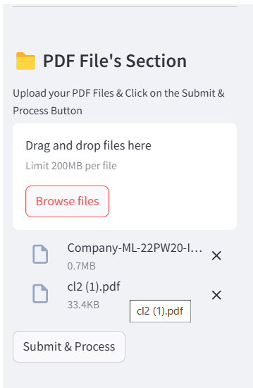

# DocuChat-AI

DocuChat-AI is an AI-powered system that enables users to interactively chat with multiple PDFs. Leveraging advanced natural language processing (NLP) techniques, it extracts and understands content from documents, allowing users to ask questions and receive contextual responses.

##Deployment Link
https://chatbot-pdf-div-kav-har-ind.streamlit.app/

## 🚀 Features
- 📄 Upload multiple PDFs and extract insights instantly
- 🧠 AI-powered chatbot for document-based Q&A
- ⚡ Fast and efficient document search using **FAISS**
- 🏗 Built with **Python, OpenAI API, FAISS, and Streamlit**

## 🛠 Tech Stack
- **Frontend:** Streamlit
- **Backend:** Python (Flask/FastAPI for API handling)
- **AI:** OpenAI GPT for text understanding
- **Database:** FAISS for vector search

## 🎯 How It Works
1. **Upload PDFs** – The system processes and converts them into an AI-readable format.
2. **Embedding & Indexing** – Text is chunked and embedded using FAISS.
3. **Chat with AI** – Users ask questions, and the AI retrieves and generates answers based on the PDFs.

## 🔧 Installation
```sh
# Clone the repository
git clone https://github.com/divyaprabha1805/DocuChat-AI.git
cd DocuChat-AI

# Create a virtual environment
python -m venv venv
source venv/bin/activate  # On Windows use: venv\Scripts\activate

# Install dependencies
pip install -r requirements.txt

# Run the application
streamlit run chatapp.py
```

## 📌 Usage
1. **Launch the app** using `streamlit run chatapp.py`
2. **Upload your PDFs**
3. **Ask questions**, and the AI will respond based on the document content

## 📷 Screenshot




## 🌟 Future Enhancements
- 🔹 Support for more file formats (DOCX, TXT)
- 🔹 Advanced summarization and keyword extraction
- 🔹 Multi-user support with authentication

## 🤝 Contributing
Contributions are welcome! Feel free to fork the repository, open an issue, or submit a pull request.

Developed by **Divya Prabha** 🚀
